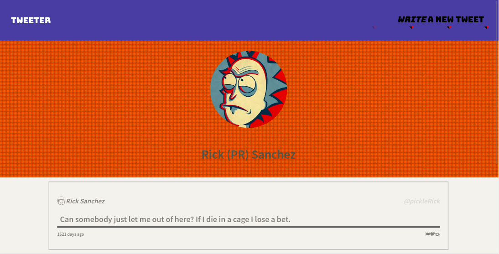
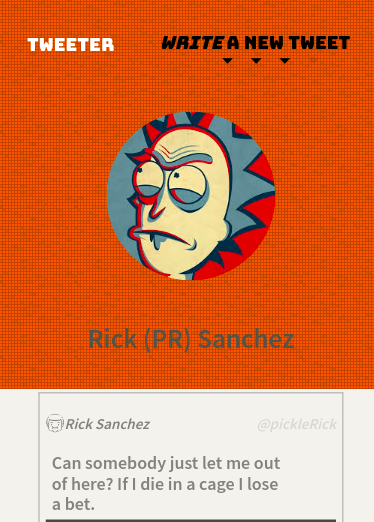
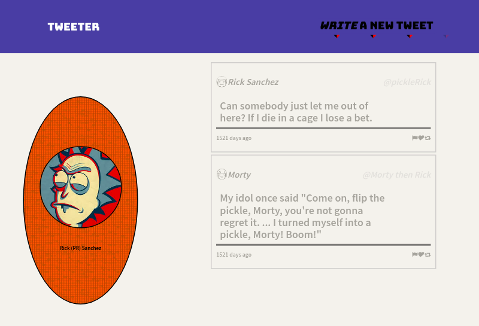

# Tweeter Project

Tweeter is a simple, single-page Twitter clone.

## Final Product

## Dependencies

- Node.js
- Express
- body-parser
- chance
- md5

## Getting Started

- Install all dependencies (using the `npm install` command).
- Run the development web server using the `node express_server.js` command.
